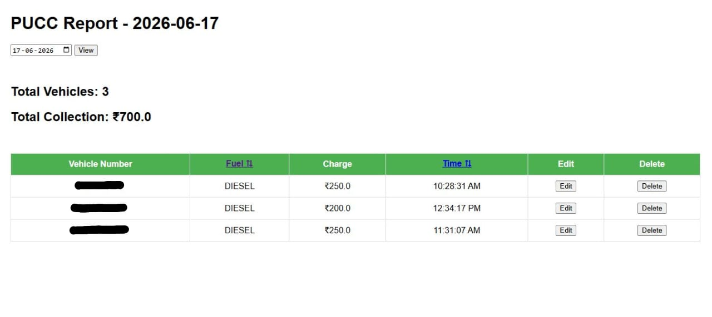

# PUCC Tracker 🚗

A lightweight account management software built to simplify daily record keeping in a PUCC center.

## Overview

Previously, daily vehicle records and collections were maintained manually by writing down vehicle numbers and calculating totals at the end of the day.

PUCC Tracker automates this process by capturing certificate details during printing and maintaining digital records automatically.

The software helps reduce manual work and makes daily account management faster and easier.

## Features

* Automatic capture of certificate details
* Daily collection tracking
* Date-wise historical reports
* Edit and delete records
* Fuel-wise sorting
* Time-wise sorting
* Automatic total calculation
* Lightweight local database storage

## Tech Stack

* Python
* Flask
* SQLite
* JavaScript
* Chrome Extension

## How It Works

Certificate Printing 
↓ 
Automatic Data Capture 
↓ 
Database Storage 
↓ 
Report Dashboard

## Dashboard

The report dashboard provides a quick overview of daily vehicle entries, collections, and historical records with sorting and editing capabilities.

## Future Improvements

* Monthly reports
* Search functionality
* Certificate preview
* Database backup

## Project Purpose

This project was developed to simplify the daily account management process in a real-world PUCC center and reduce manual bookkeeping.

---

**Developed by Devadharshini S**
